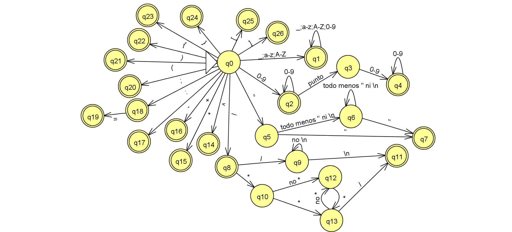

# Compilador M
## Un pequeño compilador que hace operaciones matematicas simples


### Este proyecta esta creado en C#
- Se utilizo **VS 2019**
- El framework es **.NET Framework 4.8**
- Cuenta con una interfaz **Windows Form**

### El proyecto se dividira en 14 puntos
- [x] *1. Creacion del proyecto*
- [x] *2. Crear y dar formato a la ventana*
     - [x] *1. Barra de menu*
       - [ ] *Cargar un documento*
       - [ ] *Guardar un documento*
       - [ ] *Guardar un nuevo documento*
       - [ ] *Nuevo documento*
     - [x] *2. RichTextBox*
- [x] *3. Tokens*
- [x] ~*4. .json de palabras reservadas*~
- [x] *4. funcion buscadora de palabras reservadas*
- [x] *5. Analizador Lexico*
- [x] *6. Remarcado de tokens*
- [ ] *7. Tabla de simbolos*
- [ ] *8. Analizador sintactico*
- [ ] *9. Arbol sintactico*
- [ ] *10. Analizador semantico*
- [ ] *11. Arbol Abstracto*
- [ ] *12. Codigo intermedio*
- [ ] *13. Generador de codigo*
- [ ] *14. Codigo objeto*


### Automata
 

### Gramatica
```
bloque      ::= <asignacion> ;
bloque      ::= <funcion> ;
asignacion  ::= var := <exp>
exp         ::= <exp> <op> <exp> 
exp         ::= ( <exp> ) 
exp         ::= <funcion> 
exp         ::= var
exp         ::= numero 
funcion     ::= reservada ( <exp> )
op          ::= + 
op          ::= - 
op          ::= * 
op          ::= / 
op          ::= ^
```

### Finalidad del proyecto
- Este proyecto se elabora con fines de aprendizaje
- Se trata de generar un compilador simple en el cual puedan basarse para que generen el propio

### ¿Te interesa este proyecto?
- Si te interesa este proyecto puedes clonar el repositorio
- Lo unico que se pide es que se den creditos al autor


### ¿Tienes dudas?
- Puedes preguntar cualquier duda que tengas ante el proyecto
